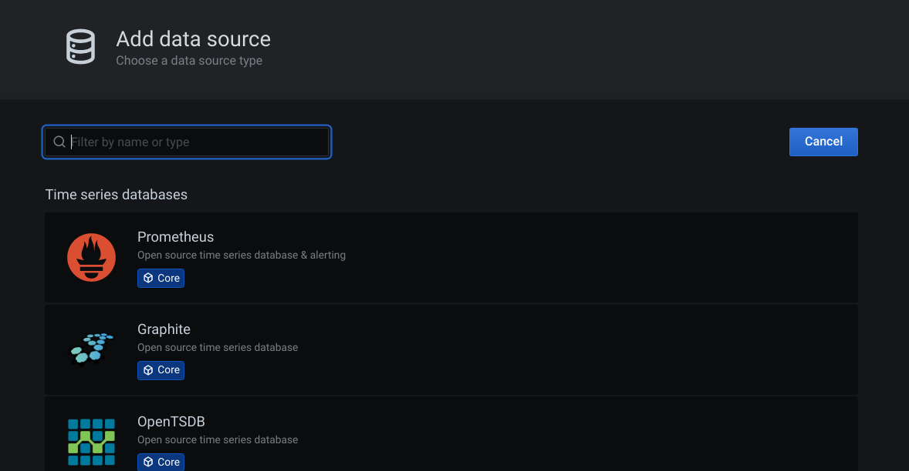
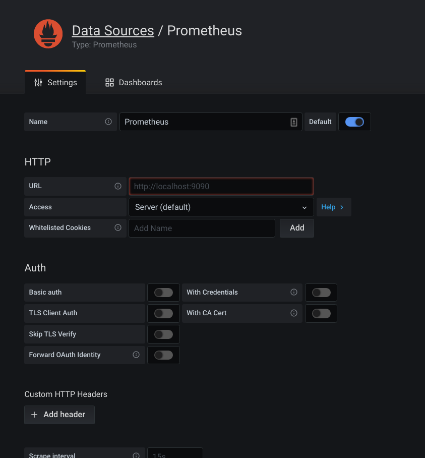
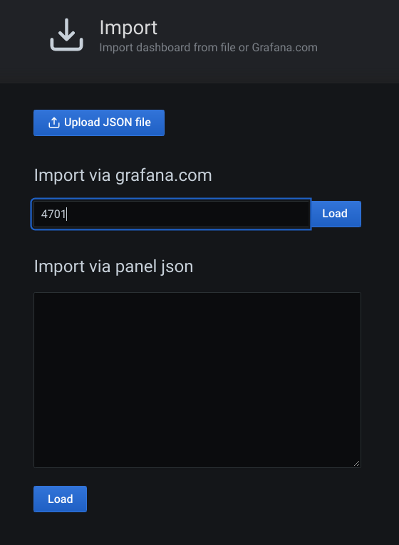

# microservice
Microservice Authorization server - Resource Server - Gateway

## Oauth2 server
Authentication server using asymmetric

- Import database
- Generate keypair

------------ Branch Master -----------------
 
 Used Jwt token store. Token generated store in memory.
 
------------ Branch oauth2-server-jdbc -----------------
 
 Used Jwt token store. Token generated store in database.
 
------------ Branch oauth2-server-jwt ------
 
 Used Jwt token store. Token generated store in memory.

## Resource server
- Resource Service: Skeleton code for Resource Server
- Order Service, Delivery Service,... is resource server

## Registry
- Eureka server

## Gateway server
- Gateway discovery service

## Config
- Spring cloud config for properties

## Common

- Common for Role Base Access Control
- Common Util: Util method
- Common Dto: DTO class
- Common Entity: Entity mapping from database
 
## Database
- MySQL
- Database per service
- Transaction rollback following Sagas pattern

- PostgreSQL: One database with multiple schemas
    
    - database: postgreSQL
    - schemas: delivery_db, auditor_db,...

### kafka
zookeeper-server-start /usr/local/etc/kafka/zookeeper.properties & kafka-server-start /usr/local/etc/kafka/server.properties

## Event driven
- using Kafka or Rest : done

Delivery Service:
Delivery changed status delivered send an event to Order Service:
http://localhost:8766/delivery-service/v1/delivery/delivered

Order Service:
delete order send an event to Delivery Service for cancel delivery
http://localhost:8765/order-service/v1/order/6

Current code not fully adapt ACID in case update order or delivery status failure but event sent successful. To avoid this need apply OUTBOX pattern: event will save to database in table OUTBOX, use polling job (scheduler in spring boot) or debezium... send event to Kafka

### Running
Step 1: Start config service

Step 2: Start Registry service

Step 3: Start Gateway service

Step 4: Start other services

### Network (Service Mesh)

All request go through gateway:

    A. External:
    
    requests -> gateway -> services

    B. Internal: 
    
    Requests -> Gateway -> Services
    
    Requests -> Services -> Services

### Distributed Tracing
Open Zipkin: Running latest image docker run -d -p 9411:9411 openzipkin/zipkin. Data store in-memory

more version for zipkin: https://hub.docker.com/u/openzipkin

Admin UI: http://localhost:9411/zipkin/?serviceName=delivery-service&lookback=30m&endTs=1608301463449&limit=10

### Exception Tracing
https://sentry.io

### Log Tracing
ELK

### Metrics

#### Spring actuator: 
https://docs.spring.io/spring-boot/docs/current/reference/html/production-ready-features.html

docker inspect container_id

http://{container_ip}:8766/delivery-service/actuator/prometheus

#### Prometheus:

/devoops/prometheus.yml

docker run --name=prometheus -p 9090:9090 -v /Users/nguyendangtuan/Documents/Project/microservice/devoops/prometheus.yml:/etc/prometheus/prometheus.yml prom/prometheus

http://localhost:9090/targets

#### Grafana
docker run -d --name=grafana -p 3000:3000 grafana/grafana
 user: admin/123456
 
http://localhost:3000/

- Create data source

- Import dashboard

