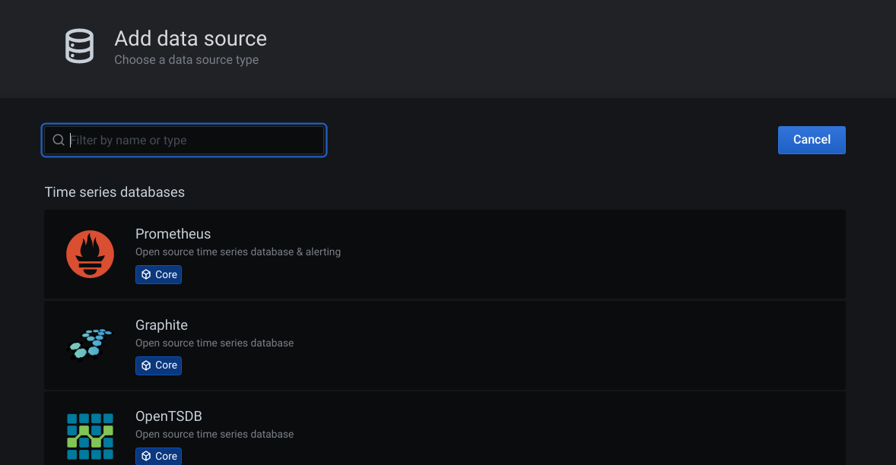
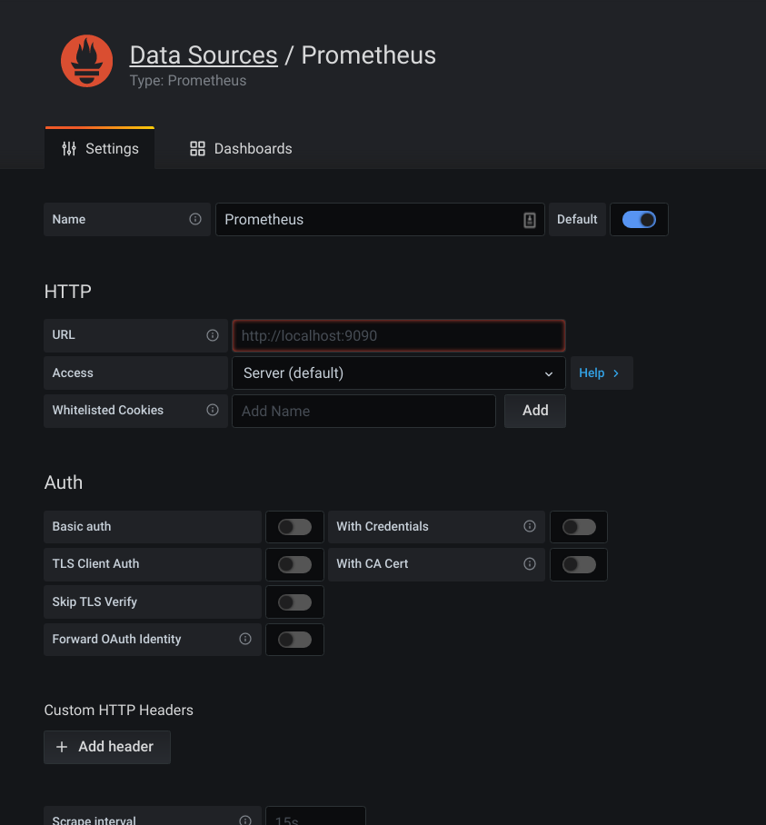
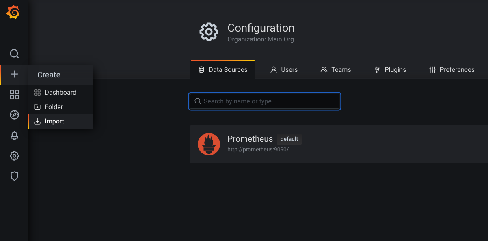
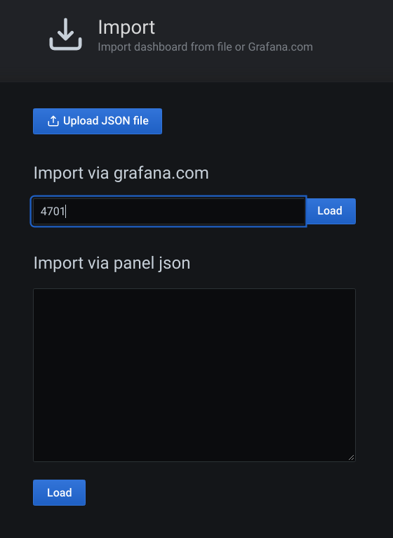

# Delivery Service
Delivery service: receive request delivery send to third party like Lalamove, Delivery roo, Grab...Tracking and update status delivery to customers
### Tech specification
Spring boot
### Deployment
### Health API
http://localhost:8766/delivery-service/actuator/health

### Tracing
Open Zipkin: Running latest image docker run -d -p 9411:9411 openzipkin/zipkin. Data store in-memory

more version for zipkin: https://hub.docker.com/u/openzipkin

Admin UI: http://localhost:9411/zipkin/?serviceName=delivery-service&lookback=30m&endTs=1608301463449&limit=10

### Exception tracing
https://sentry.io

### Metrics

#### Spring actuator: 
https://docs.spring.io/spring-boot/docs/current/reference/html/production-ready-features.html

docker inspect container_id

http://{container_ip}:8766/delivery-service/actuator/prometheus

#### Prometheus:

../devoops/prometheus.yml

docker run --name=prometheus -p 9090:9090 -v /Users/nguyendangtuan/Documents/Project/microservice/devoops/prometheus.yml:/etc/prometheus/prometheus.yml prom/prometheus

http://localhost:9090/targets

#### Grafana
docker run -d --name=grafana -p 3000:3000 grafana/grafana
 user: admin/123456
 
http://localhost:3000/

- Create data source

- Import dashboard

